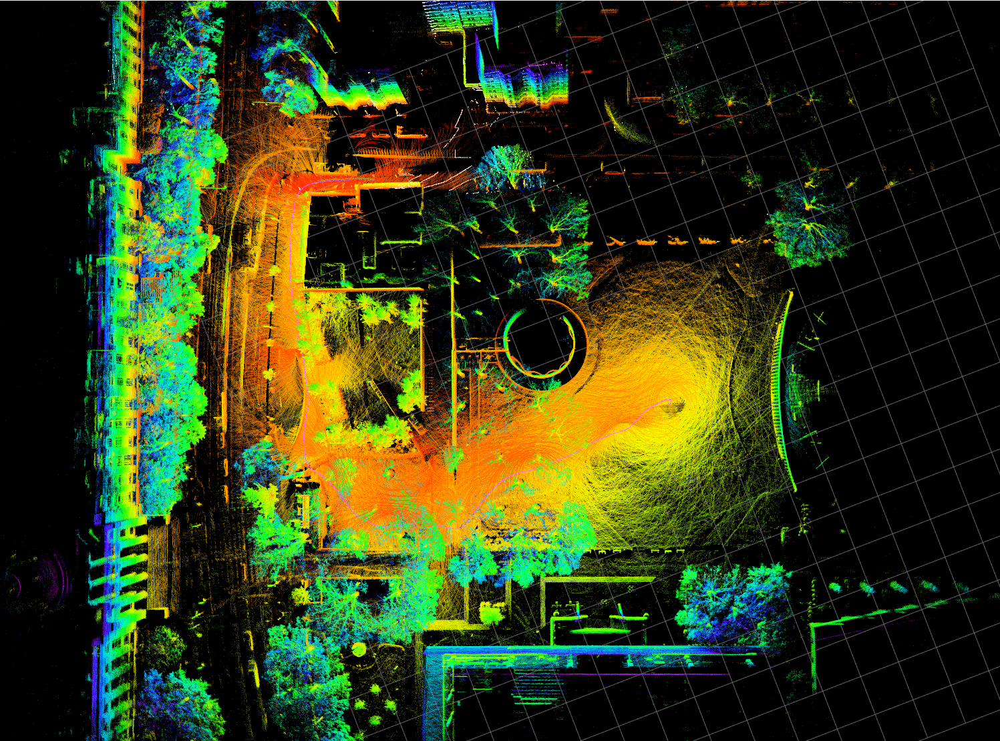
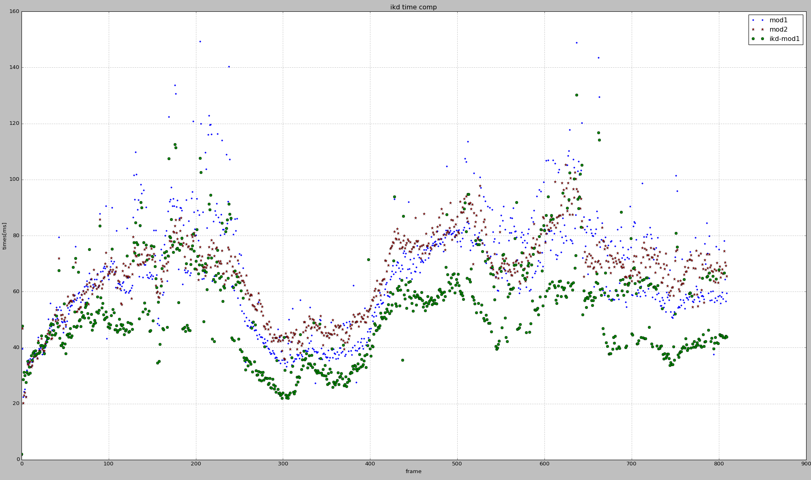
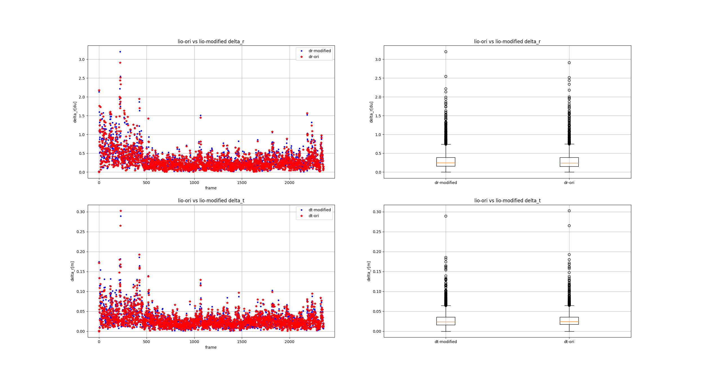
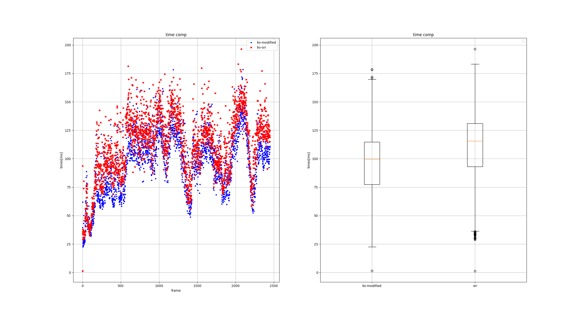
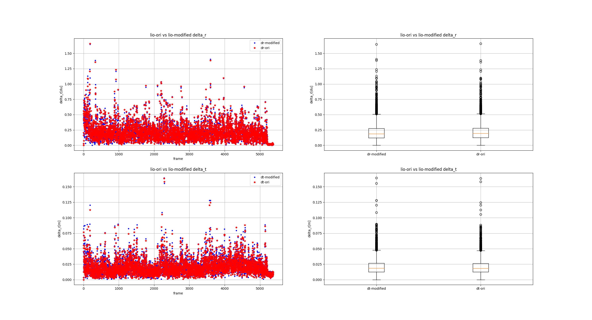
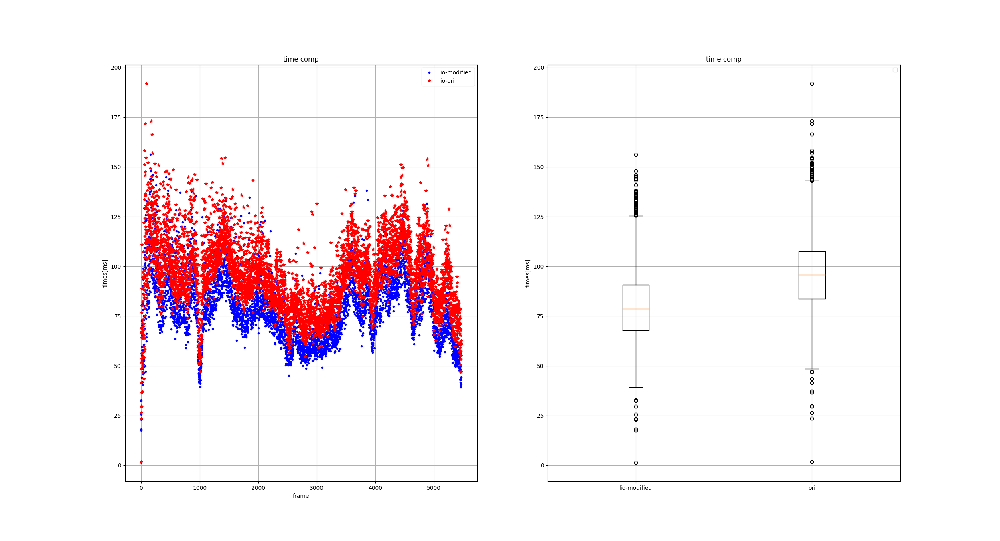
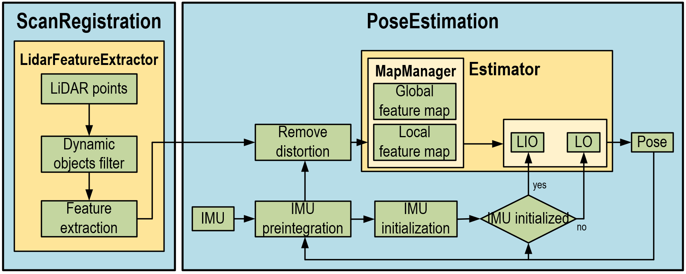
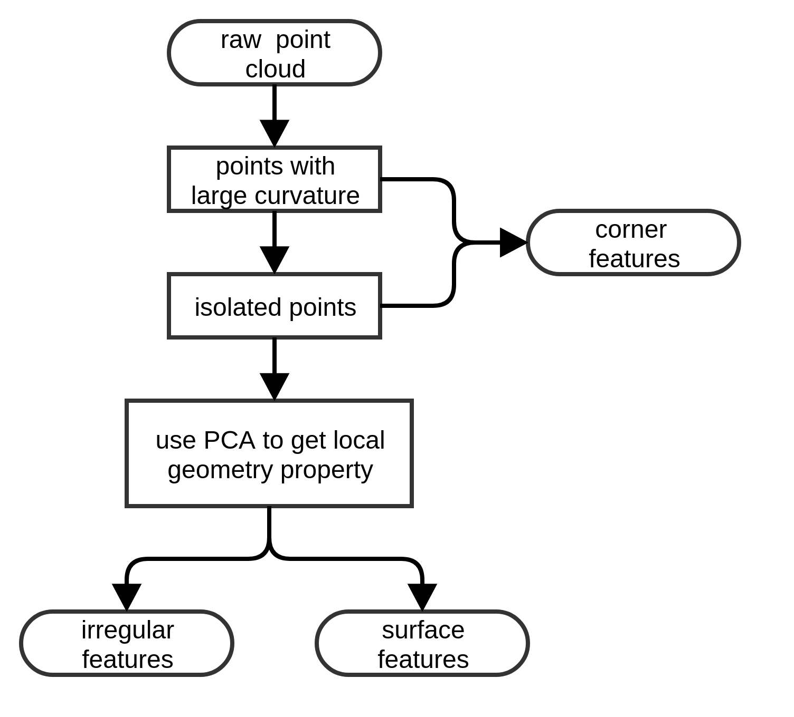

<a href="#"></img></a>
  <a href="#"></img></a>
  <a href="#"></img></a>
  <a href="#"></img></a>
  <a href="https://github.com/chengwei0427/LIO-Livox-modified/issues"></img></a>
  <a href="https://github.com/chengwei0427/LIO-Livox-modified/graphs/contributors"></img></a>


# Lio-spinning-lidar

This repository is a modified LiDAR-inertial odometry system for Spinning LiDAR. The system is developed based on the open-source odometry framework [**LIO-Livox**](https://github.com/Livox-SDK/LIO-Livox) to get the odometry information. And the feature extract moudle is implemented based on [**LIO-SAM**](https://github.com/TixiaoShan/LIO-SAM) .

## Modification

  - Feature extract moudle is implemented based on lio-sam, this moudle support velodyne,ouster and livox lidar;
  - Modify the PoseEstimation moudle , **not rely on sophus**,--[**This part is not uploaded to the repository**].
  - map manager use ikdtree instead of the original two individual (global & local) map；
  
  [update 2022-07-06]

  - use mid-integrate instead of euler-integrate;
  - use analytic derivative instead of automatic derivative(lidar-factor and imu-factor);

## demo

**Test with ouster-32(os1),holding OS laser, riding a scooter to collect this test data**
<div align="center">

</div>

**Test with ouster-64(os1), this data is collected on a ground robot(max speed 1.2m/s)**
<div align="center">

</div>

**Test with west.bag(lio-sam)**
<div align="center">

</div>

## Example results 
- city road test with vlp-16 vehicle-mounted  [bilibili video](https://www.bilibili.com/video/BV1wZ4y1174Z?spm_id_from=333.337.search-card.all.click) 
- city road test with OS1-32, riding a scooter [bilibili video](https://www.bilibili.com/video/BV1UR4y1N7rs?spm_id_from=333.337.search-card.all.click)

##	time compare (ikdtree and the original)

<div align="center">

</div>

map manager use ikdtree instead of the original two individual (global & local) map.

### notes

- Ikd-tree is not necessarily a good way when you need to re-search the nearest neighbor points every time.It takes more time than the original KDTree.you can have a look [here](https://github.com/LimHyungTae/ikd_tree_ros)

## new PoseEstimation [update 2022-07-06]

#### Test with ouster-OS1-32, corresponding test [VIDEO](https://www.bilibili.com/video/BV1na41197FZ?spm_id_from=333.999.0.0&vd_source=438f630fe29bd5049b24c7f05b1bcaa3)

delta_R and delta_T [the difference between (imu preintegrate) predict pose and the optimized pose]
<div align="center">

</div>

Time about process one frame lidar data.
<div align="center">

</div>

#### Test with velodyne-16(lio-sam dataset: park)

delta_R and delta_T [the difference between (imu preintegrate) predict pose and the optimized pose]
<div align="center">

</div>

Time about process one frame lidar data.
<div align="center">

</div>

--------------=----------------------------  divide line  ----------------------------------------------


# LIO-Livox (A Robust LiDAR-Inertial Odometry for Livox LiDAR)
This respository implements a robust LiDAR-inertial odometry system for Livox LiDAR. 
The system uses only a single Livox LiDAR with a built-in IMU. It has a robust initialization module, 
which is independent to the sensor motion. **It can be initialized with the static state, dynamic state, and the mixture of static and dynamic state.** 
The system achieves super robust performance. **It can pass through a 4km-tunnel and run on the highway with a very high speed (about 80km/h) using a single Livox Horizon.**
Moreover, **it is also robust to dynamic objects**, such as cars, bicycles, and pedestrains. It obtains high precision of localization even in traffic jams.
**The mapping result is precise even most of the FOV is occluded by vehicles.**
Videos of the demonstration of the system can be found on Youtube and Bilibili. *NOTE: Images are only used for demonstration, not used in the system.*

**Developer**: [Livox](www.livoxtech.com)

<div align="center">


</div>

## System achritecture

<div align="center">

</div>

The system consists of two ros nodes: ScanRegistartion and PoseEstimation.
*  The class "LidarFeatureExtractor" of the node "ScanRegistartion" extracts corner features, surface features, and irregular features from the raw point cloud.
*  In the node "PoseEstimation", the main thread aims to estimate sensor poses, while another thread in the class "Estimator" uses the class "MapManager" to build and manage feature maps.

The system is mainly designed for car platforms in the large scale outdoor environment.
Users can easily run the system with a Livox Horizon LiDAR.Horizon 

The system starts with the node "ScanRegistartion", where feature points are extracted. Before the feature extraction, dynamic objects are removed from the raw point cloud, since in urban scenes there are usually many dynamic objects, which 
affect system robustness and precision. For the dynamic objects filter, we use a fast point cloud segmentation method. The Euclidean clustering is applied to group points into some clusters. The raw point cloud is divided into ground points, background points, and foreground points. 
Foreground points are considered as dynamic objects, which are excluded form the feature extraction process. Due to the dynamic objects filter, the system obtains high robustness in dynamic scenes.

In open scenarios, usually few features can be extracted, leading to degeneracy on certain degrees of freedom. To tackle this problem, we developed a feature extraction process to make the distribution of feature points wide and uniform. 
A uniform and wide distribution provides more constraints on all 6 degrees of freedom, which is helpful for eliminating degeneracy. Besides, some irregular points also provides information in feature-less
scenes. Therefore, we also extract irregular features as a class for the point cloud registration.
Feature points are classifed into three types, corner features, surface features, and irregular features, according to their
local geometry properties. We first extract points with large curvature and isolated points on each scan line as corner points. Then principal components analysis (PCA) is performed to classify surface features and irregular features, as shown in the following figure. 
For points with different distance, thresholds are set to different values, in order to make the distribution of points in space as uniform as possible. 

<div align="center">

</div>

In the node "PoseEstimation", the motion distortion of the point cloud is compensated using IMU preintegration or constant velocity model. Then the IMU initialization module is performed. If the Initialization
is successfully finished, the system will switch to the LIO mode. Otherwise, it run with LO mode and initialize IMU states. In the LO mode, we use a frame-to-model point cloud registration to estimate the sensor pose.
Inspired by ORB-SLAM3, a maximum a posteriori (MAP) estimation method is adopted to jointly initialize IMU biases, velocities, and the gravity direction.
This method doesn't need a careful initialization process. **The system can be initialized with an arbitrary motion.** This method takes into account sensor uncertainty, which obtains the optimum in the sense of maximum posterior probability.
It achieves efficient, robust, and accurate performance.
After the initialization, a tightly coupled slding window based sensor fusion module is performed to estimate IMU poses, biases, and velocities within the sliding window.
Simultaneously, an extra thread builds and maintains the global map in parallel. 


## Prerequisites
*  [Ubuntu](http://ubuntu.com) (tested on 16.04 and 18.04)
*  [ROS](http://wiki.ros.org/ROS/Installation) (tested with Kinetic and Melodic)
*  [Eigen](http://eigen.tuxfamily.org/index.php?title=Main_Page)
*  [Ceres Solver](http://ceres-solver.org/installation.html)
*  [PCL](http://www.pointclouds.org/downloads/linux.html)
*  [livox_ros_driver](https://github.com/Livox-SDK/livox_ros_driver)
*  Suitesparse
   ```
   sudo apt-get install libsuitesparse-dev
   ```

## Compilation
```
cd ~/catkin_ws/src
git clone https://github.com/Livox-SDK/LIO-Livox
cd ..
catkin_make
```

## Run with bag files:
### Run the launch file:
```
cd ~/catkin_ws
source devel/setup.bash
roslaunch lio_livox horizon.launch
```

#### Play your bag files:
```
rosbag play YOUR_ROSBAG.bag
```

## Run with your device:
### Run your LiDAR with livox_ros_driver
```
cd ~/catkin_ws
source devel/setup.bash
roslaunch livox_ros_driver livox_lidar_msg.launch
```

### Run the launch file:
```
cd ~/catkin_ws
source devel/setup.bash
roslaunch lio_livox horizon.launch
```

## Notes:
The current version of the system is only adopted for Livox Horizon. In theory, it should be able to run directly with a Livox Avia, but we haven't done enough tests.
Besides, the system doesn't provide a interface of Livox mid series. If you want use mid-40 or mid-70, you can try [livox_mapping](https://github.com/Livox-SDK/livox_mapping).

The topic of point cloud messages is /livox/lidar and its type is livox_ros_driver/CustomMsg. \
The topic of IMU messages is /livox/imu and its type is sensor_msgs/Imu.

There are some parameters in launch files:
*  IMU_Mode: choose IMU information fusion strategy, there are 3 modes:
    -  0 - without using IMU information, pure LiDAR odometry, motion distortion is removed using a constant velocity model 
    -  1 - using IMU preintegration to remove motion distortion 
    -  2 - tightly coupling IMU and LiDAR information
*  Extrinsic_Tlb: extrinsic parameter between LiDAR and IMU, which uses SE3 form. If you want to use an external IMU, you need to calibrate your own sensor suite
and change this parameter to your extrinsic parameter.

There are also some parameters in the config file:
*  Use_seg: choose the segmentation mode for dynamic objects filtering, there are 2 modes:
    -  0 - without using the segmentation method, you can choose this mode if there is few dynamic objects in your data
    -  1 - using the segmentation method to remove dynamic objects

## Acknowledgements
Thanks for following work:
* [LOAM](https://github.com/cuitaixiang/LOAM_NOTED) (LOAM: Lidar Odometry and Mapping in Real-time)
* [VINS-Mono](https://github.com/HKUST-Aerial-Robotics/VINS-Mono) (VINS-Mono: A Robust and Versatile Monocular Visual-Inertial State Estimator)
* [LIO-mapping](https://github.com/hyye/lio-mapping) (Tightly Coupled 3D Lidar Inertial Odometry and Mapping)
* [ORB-SLAM3](https://github.com/UZ-SLAMLab/ORB_SLAM3) (ORB-SLAM3: An Accurate Open-Source Library for Visual, Visual-Inertial and Multi-Map SLAM)
* [LiLi-OM](https://github.com/KIT-ISAS/lili-om) (Towards High-Performance Solid-State-LiDAR-Inertial Odometry and Mapping)
* [MSCKF_VIO](https://github.com/KumarRobotics/msckf_vio) (Robust Stereo Visual Inertial Odometry for Fast Autonomous Flight)
* [horizon_highway_slam](https://github.com/Livox-SDK/horizon_highway_slam)
* [livox_mapping](https://github.com/Livox-SDK/livox_mapping)
* [livox_horizon_loam](https://github.com/Livox-SDK/livox_horizon_loam)

## Support
You can get support from Livox with the following methods:
*  Send email to [cs@livoxtech.com](cs@livoxtech.com) with a clear description of your problem and your setup
*  Report issues on github
